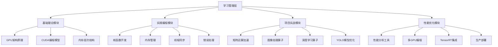

# CUDA编程精通学习系统设计文档

## 概述

本系统采用渐进式学习架构，通过理论学习、实践编程、项目实战三个层次，帮助学习者从CUDA新手成长为能够开发高性能GPU应用的专家。系统设计遵循"学以致用"的原则，每个学习模块都配备相应的实践项目。

## 架构设计

### 整体架构



### 学习路径设计

系统采用四阶段递进式学习路径：

1. **基础阶段** (1-2周): GPU架构理解和CUDA环境搭建
2. **核心阶段** (3-4周): 核函数开发和内存优化
3. **进阶阶段** (5-6周): 自定义算子和复杂应用开发  
4. **专家阶段** (7-8周): YOLO加速和生产级优化

## 组件和接口

### 1. 环境配置组件

**功能**: 自动检测和配置CUDA开发环境

**核心接口**:
```cpp
class CudaEnvironment {
public:
    bool detectGPU();
    bool installCudaToolkit();
    bool configureDevelopmentEnvironment();
    std::vector<GPUInfo> getAvailableGPUs();
};
```

**实现要点**:
- 自动检测GPU型号和计算能力
- 验证CUDA工具链完整性
- 配置编译环境和调试工具
- 提供环境诊断和修复功能

### 2. 代码示例管理组件

**功能**: 管理分级的CUDA代码示例和练习

**核心接口**:
```cpp
class CodeExampleManager {
public:
    std::vector<Example> getExamplesByLevel(LearningLevel level);
    bool compileAndRun(const std::string& code);
    PerformanceMetrics benchmarkCode(const std::string& code);
    std::string generateTemplate(ExampleType type);
};
```

**示例分类**:
- **入门级**: Hello World, 向量加法, 矩阵乘法
- **中级**: 共享内存优化, 流并行, 纹理内存
- **高级**: 自定义算子, 多GPU通信, 动态并行

### 3. 性能分析组件

**功能**: 提供代码性能分析和优化建议

**核心接口**:
```cpp
class PerformanceAnalyzer {
public:
    ProfileResult profileKernel(const std::string& kernelName);
    OptimizationSuggestions analyzeBottlenecks(const ProfileResult& result);
    bool comparePerformance(const std::string& code1, const std::string& code2);
    MemoryUsageReport analyzeMemoryUsage();
};
```

**分析维度**:
- 执行时间和吞吐量
- 内存带宽利用率
- 占用率和线程效率
- 寄存器和共享内存使用

### 4. 自定义算子开发框架

**功能**: 提供算子开发的脚手架和最佳实践

**核心接口**:
```cpp
template<typename T>
class CustomOperator {
public:
    virtual void forward(const Tensor<T>& input, Tensor<T>& output) = 0;
    virtual void backward(const Tensor<T>& grad_output, Tensor<T>& grad_input) = 0;
    virtual void optimize() = 0;
    
protected:
    void launchKernel(dim3 grid, dim3 block, size_t sharedMem = 0);
    void synchronizeStream();
};
```

**支持的算子类型**:
- 基础数学运算 (加减乘除、激活函数)
- 矩阵运算 (GEMM、批量矩阵乘法)
- 卷积运算 (2D/3D卷积、转置卷积)
- 池化运算 (最大池化、平均池化、自适应池化)

### 5. YOLO加速优化组件

**功能**: 专门针对YOLO模型的GPU加速实现

**核心接口**:
```cpp
class YOLOAccelerator {
public:
    bool loadModel(const std::string& modelPath);
    std::vector<Detection> inference(const cv::Mat& image);
    void optimizeForBatchSize(int batchSize);
    void enableTensorRTOptimization();
    
private:
    void optimizeBackbone();
    void optimizeNeck();
    void optimizeHead();
    void fuseOperations();
};
```

**优化策略**:
- 算子融合减少内存访问
- 批处理优化提高吞吐量
- TensorRT集成自动优化
- 自定义CUDA核函数替换瓶颈操作

## 数据模型

### 学习进度模型
```cpp
struct LearningProgress {
    std::string userId;
    LearningLevel currentLevel;
    std::vector<CompletedModule> completedModules;
    std::map<std::string, float> skillScores;
    std::vector<ProjectResult> projectResults;
    DateTime lastActivity;
};
```

### 性能基准模型
```cpp
struct PerformanceBenchmark {
    std::string testName;
    float executionTime;
    float memoryBandwidth;
    float occupancy;
    int registerUsage;
    int sharedMemoryUsage;
    std::string gpuModel;
    DateTime timestamp;
};
```

### 代码示例模型
```cpp
struct CodeExample {
    std::string id;
    std::string title;
    std::string description;
    LearningLevel difficulty;
    std::string sourceCode;
    std::string expectedOutput;
    std::vector<std::string> learningObjectives;
    std::vector<std::string> prerequisites;
};
```

## 错误处理

### CUDA运行时错误处理
```cpp
#define CUDA_CHECK(call) \
    do { \
        cudaError_t error = call; \
        if (error != cudaSuccess) { \
            handleCudaError(error, __FILE__, __LINE__); \
        } \
    } while(0)

void handleCudaError(cudaError_t error, const char* file, int line);
```

### 编译错误诊断
- 提供常见编译错误的解决方案
- 自动检测架构兼容性问题
- 给出优化建议和警告解释

### 性能问题诊断
- 检测内存访问模式问题
- 识别线程发散和银行冲突
- 提供具体的优化建议

## 测试策略

### 单元测试
- 每个CUDA核函数的正确性验证
- 内存管理函数的边界测试
- 性能分析组件的准确性测试

### 集成测试
- 完整学习路径的端到端测试
- 多GPU环境下的功能测试
- 不同GPU架构的兼容性测试

### 性能测试
- 基准测试套件验证优化效果
- 回归测试确保性能不降级
- 压力测试验证系统稳定性

### 用户验收测试
- 学习效果评估和反馈收集
- 实际项目应用的成功率统计
- 用户体验和界面易用性测试

## 部署和扩展

### 开发环境支持
- Visual Studio Code插件集成
- Jupyter Notebook交互式学习
- Docker容器化部署方案

### 云端支持
- Google Colab集成
- AWS/Azure GPU实例支持
- 远程开发环境配置

### 扩展性设计
- 模块化架构支持新算子类型
- 插件系统支持第三方扩展
- API接口支持外部工具集成